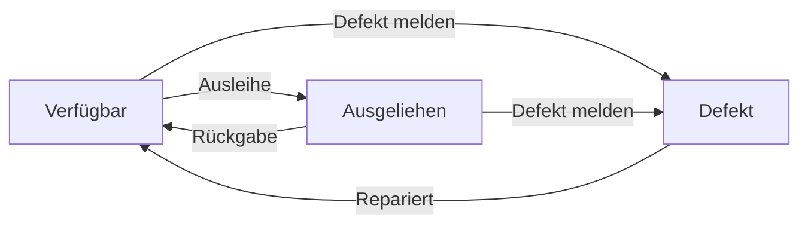
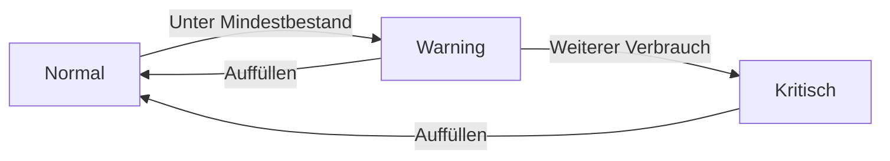

# Scandy - AI Technical Documentation

## Quick Reference

### Common Operations
```python
# Tool ausleihen
INSERT INTO tool_lendings (tool_barcode, worker_id, lent_at, lending_reason) 
VALUES (?, ?, CURRENT_TIMESTAMP, ?)

# Tool zurückgeben
UPDATE tool_lendings 
SET returned_at = CURRENT_TIMESTAMP 
WHERE tool_barcode = ? AND returned_at IS NULL

# Verbrauchsmaterial nutzen
INSERT INTO consumable_usages (consumable_barcode, worker_id, amount, usage_date, usage_reason)
VALUES (?, ?, ?, CURRENT_TIMESTAMP, ?)

# Bestand aktualisieren
UPDATE consumables 
SET current_stock = current_stock - ? 
WHERE barcode = ?
```

### Template Variables
```python
# Global verfügbare Variablen
- request.args: GET Parameter
- request.form: POST Parameter
- session: Session-Daten
- g: Globaler Kontext
- config: App-Konfiguration

# Context Processor Variablen
def utility_processor():
    return {
        'format_date': format_date,
        'format_datetime': format_datetime,
        'get_status_badge': get_status_badge,
        'get_stock_status': get_stock_status
    }
```

### JavaScript Event Handlers
```javascript
// tools.js
document.addEventListener('DOMContentLoaded', () => {
    setupToolHandlers();
    setupStatusChangeHandlers();
    setupSearchHandlers();
});

// consumables.js
document.addEventListener('DOMContentLoaded', () => {
    setupStockHandlers();
    setupUsageHandlers();
    setupSearchHandlers();
});
```

### Error Codes & Messages
```python
ERROR_CODES = {
    'TOOL_NOT_FOUND': ('T001', 'Werkzeug nicht gefunden'),
    'TOOL_ALREADY_LENT': ('T002', 'Werkzeug bereits ausgeliehen'),
    'INVALID_STATUS': ('T003', 'Ungültiger Status'),
    'CONSUMABLE_NOT_FOUND': ('C001', 'Verbrauchsmaterial nicht gefunden'),
    'INSUFFICIENT_STOCK': ('C002', 'Nicht genügend Bestand'),
    'WORKER_NOT_FOUND': ('W001', 'Mitarbeiter nicht gefunden'),
    'WORKER_INACTIVE': ('W002', 'Mitarbeiter nicht aktiv'),
    'DB_ERROR': ('D001', 'Datenbankfehler'),
    'VALIDATION_ERROR': ('V001', 'Validierungsfehler')
}
```

### Security Considerations
```python
# CSRF Protection
app.config['WTF_CSRF_SECRET_KEY'] = 'random-key-for-csrf'
csrf = CSRFProtect(app)

# XSS Protection
# Jinja2 Auto-Escaping aktiviert
app.jinja_env.autoescape = True

# SQL Injection Prevention
# Parametrisierte Queries in Database class
def query_db(self, query, args=(), one=False):
    cur = self.get_db().execute(query, args)  # args wird escaped
```

### Performance Optimizations
```python
# Query Optimierungen
OPTIMIZED_QUERIES = {
    'tool_detail': '''
        SELECT t.*, 
            w.name as worker_name,
            tl.lent_at as lending_date,
            COUNT(DISTINCT tsc.id) as status_changes,
            COUNT(DISTINCT tlh.id) as lending_history
        FROM tools t
        LEFT JOIN tool_lendings tl ON t.barcode = tl.tool_barcode 
            AND tl.returned_at IS NULL
        LEFT JOIN workers w ON tl.worker_id = w.id
        LEFT JOIN tool_status_changes tsc ON t.barcode = tsc.tool_barcode
        LEFT JOIN tool_lendings tlh ON t.barcode = tlh.tool_barcode
        WHERE t.barcode = ?
        GROUP BY t.barcode
    ''',
    'consumable_detail': '''
        SELECT c.*,
            COUNT(DISTINCT cu.id) as usage_count,
            SUM(cu.amount) as total_used,
            MAX(cu.usage_date) as last_usage
        FROM consumables c
        LEFT JOIN consumable_usages cu ON c.barcode = cu.consumable_barcode
        WHERE c.barcode = ?
        GROUP BY c.barcode
    '''
}

# Caching Strategien
CACHE_CONFIG = {
    'CACHE_TYPE': 'filesystem',
    'CACHE_DIR': 'flask_cache',
    'CACHE_DEFAULT_TIMEOUT': 300,
    'CACHE_THRESHOLD': 1000
}
```

### Background Tasks
```python
def schedule_tasks():
    """Hintergrundaufgaben einrichten"""
    scheduler = APScheduler()
    scheduler.init_app(app)
    scheduler.start()
    
    # Tägliche Bestandsprüfung
    @scheduler.task('cron', id='check_stock', hour=0)
    def check_stock():
        db = Database()
        low_stock = db.query_db('''
            SELECT * FROM consumables 
            WHERE current_stock <= minimum_stock
        ''')
        if low_stock:
            send_stock_notification(low_stock)
    
    # Wöchentliche Backup
    @scheduler.task('cron', id='backup_db', day_of_week='sun')
    def backup_database():
        backup_path = f'backups/scandy_{datetime.now():%Y%m%d}.db'
        shutil.copy2('instance/scandy.db', backup_path)
```

### Deployment Checklist
```python
DEPLOYMENT_CHECKS = {
    'database': [
        'instance/scandy.db exists',
        'correct permissions',
        'tables created',
        'indices created',
        'triggers created'
    ],
    'static_files': [
        'tailwind.css compiled',
        'js files minified',
        'correct permissions'
    ],
    'environment': [
        'all dependencies installed',
        'correct Python version',
        'environment variables set',
        'logging configured'
    ],
    'security': [
        'debug mode off',
        'secret key set',
        'csrf protection enabled',
        'secure headers configured'
    ]
}
```

## Initialization Process Details

### Virtual Environment
```powershell
# Windows-spezifische Aktivierung
.\venv\Scripts\activate.ps1  # PowerShell
.\venv\Scripts\activate.bat  # CMD
```

### Package Installation States
```python
REQUIRED_PACKAGES = {
    'flask': {
        'import_name': 'Flask',
        'import_from': 'flask',
        'min_version': '2.0.0'
    },
    'flask-session': {
        'import_name': 'Session',
        'import_from': 'flask_session',
        'min_version': '0.4.0'
    },
    'flask-compress': {
        'import_name': 'Compress',
        'import_from': 'flask_compress',
        'min_version': '1.4.0'
    }
}
```

### Database Initialization
```python
def init_db():
    """Vollständige Datenbankinitialisierung"""
    db = get_db()
    
    # Tabellen erstellen
    with current_app.open_resource('schema.sql') as f:
        db.executescript(f.read().decode('utf8'))
    
    # Indices erstellen
    with current_app.open_resource('indices.sql') as f:
        db.executescript(f.read().decode('utf8'))
    
    # Trigger erstellen
    with current_app.open_resource('triggers.sql') as f:
        db.executescript(f.read().decode('utf8'))
        
    db.commit()
```

### Error Recovery Procedures

#### Package Installation Errors
```python
def verify_dependencies():
    missing = []
    for package, details in REQUIRED_PACKAGES.items():
        try:
            module = __import__(details['import_from'])
            if not hasattr(module, details['import_name']):
                missing.append(f"{package} (falsche Version)")
        except ImportError:
            missing.append(package)
    return missing
```

#### Database Recovery
```python
def recover_database():
    """Datenbank-Wiederherstellung nach Fehler"""
    try:
        # Backup erstellen falls vorhanden
        if os.path.exists('instance/scandy.db'):
            shutil.copy2('instance/scandy.db', 'instance/scandy.db.bak')
        
        # Datenbank neu initialisieren
        init_db()
        
        return True
    except Exception as e:
        if os.path.exists('instance/scandy.db.bak'):
            shutil.copy2('instance/scandy.db.bak', 'instance/scandy.db')
        return False
```

### Template Error Handling
```python
def handle_template_error(error, template):
    """Template-Fehler analysieren"""
    if 'undefined' in str(error):
        # Fehlende Kontext-Variable
        var_name = str(error).split("'")[1]
        return f"Missing context variable: {var_name} in {template}"
    elif 'no filter named' in str(error):
        # Fehlender Filter
        filter_name = str(error).split("'")[1]
        return f"Missing filter: {filter_name} in {template}"
    return str(error)
```

### Database Connection States
```python
DB_STATES = {
    'INITIALIZED': 'Datenbank initialisiert',
    'TABLES_MISSING': 'Tabellen fehlen',
    'TRIGGERS_MISSING': 'Trigger fehlen',
    'INDICES_MISSING': 'Indices fehlen',
    'CONNECTION_ERROR': 'Verbindungsfehler',
    'PERMISSION_ERROR': 'Berechtigungsfehler'
}

def check_db_state():
    """Überprüft den Zustand der Datenbank"""
    try:
        db = get_db()
        
        # Tabellen prüfen
        tables = db.execute("""
            SELECT name FROM sqlite_master 
            WHERE type='table'
        """).fetchall()
        if not tables:
            return 'TABLES_MISSING'
            
        # Trigger prüfen
        triggers = db.execute("""
            SELECT name FROM sqlite_master 
            WHERE type='trigger'
        """).fetchall()
        if not triggers:
            return 'TRIGGERS_MISSING'
            
        # Indices prüfen
        indices = db.execute("""
            SELECT name FROM sqlite_master 
            WHERE type='index'
        """).fetchall()
        if not indices:
            return 'INDICES_MISSING'
            
        return 'INITIALIZED'
        
    except sqlite3.OperationalError as e:
        if 'permission denied' in str(e):
            return 'PERMISSION_ERROR'
        return 'CONNECTION_ERROR'
```

### Session Management Details
```python
SESSION_STATES = {
    'ACTIVE': 'Session aktiv',
    'EXPIRED': 'Session abgelaufen',
    'INVALID': 'Session ungültig',
    'MISSING': 'Keine Session'
}

def validate_session():
    """Überprüft den Session-Zustand"""
    if not session:
        return 'MISSING'
    
    if 'scandy_session' not in session:
        return 'INVALID'
        
    if 'last_activity' in session:
        last = datetime.fromisoformat(session['last_activity'])
        if datetime.now() - last > timedelta(days=1):
            return 'EXPIRED'
            
    return 'ACTIVE'
```

## Startup Sequence
1. wsgi.py/server.py -> create_app()
2. app/__init__.py Initialisierung
3. Konfiguration laden
4. Datenbank-Verbindung aufbauen
5. Blueprints registrieren
6. Template-Filter registrieren

## Error Handling & Recovery
### Dependency Errors
```python
# Fehlende Abhängigkeiten
ModuleNotFoundError: No module named 'flask_compress'
ModuleNotFoundError: No module named 'flask'
ImportError: cannot import name 'Session' from 'flask_session'

# Lösung
1. Virtuelle Umgebung aktivieren: .\venv\Scripts\activate
2. Dependencies installieren: pip install flask flask-session flask-compress
```

### Database Errors
```python
# Fehlende instance/scandy.db
sqlite3.OperationalError: no such table

# Lösung
1. instance/ Ordner erstellen
2. init_db() ausführen für Tabellenerstellung
3. Berechtigungen prüfen
```

## Template Context Requirements
### base.html
```python
required_context = {
    'title': str,  # Seitentitel
    'messages': List[str],  # Flash messages
}
```

### tools/details.html
```python
required_context = {
    'tool': {
        'barcode': str,
        'name': str,
        'category': str,
        'location': str,
        'status': str,
        'description': str,
        'defect_reason': Optional[str],
        'lent_to': Optional[str],
        'lent_at': Optional[datetime],
    },
    'history': List[{
        'action_type': str,
        'action_date': datetime,
        'description': str,
        'reason': Optional[str],
    }]
}
```

### consumables/details.html
```python
required_context = {
    'consumable': {
        'barcode': str,
        'name': str,
        'category': str,
        'location': str,
        'minimum_stock': int,
        'current_stock': int,
        'unit': str,
        'total_usages': int,
        'total_amount_used': int,
    },
    'usage_history': List[{
        'amount': int,
        'usage_date': datetime,
        'usage_reason': Optional[str],
        'worker_name': str,
    }]
}
```

## Database Transactions
```python
def execute_transaction(queries: List[Tuple[str, Tuple]]) -> None:
    """
    Führt mehrere Queries in einer Transaktion aus
    """
    db = get_db()
    try:
        for query, args in queries:
            db.execute(query, args)
        db.commit()
    except Exception as e:
        db.rollback()
        raise e
    finally:
        db.close()
```

## Status Transitions
```python
VALID_STATUS_TRANSITIONS = {
    'verfügbar': ['ausgeliehen', 'defekt'],
    'ausgeliehen': ['verfügbar', 'defekt'],
    'defekt': ['verfügbar'],
}

def validate_status_transition(old_status: str, new_status: str) -> bool:
    return new_status in VALID_STATUS_TRANSITIONS.get(old_status, [])
```

## Form Validation Rules
```python
VALIDATION_RULES = {
    'barcode': r'^[A-Za-z0-9-]+$',
    'name': r'^[A-Za-z0-9\s-]+$',
    'category': r'^[A-Za-z0-9\s-]+$',
    'location': r'^[A-Za-z0-9\s-]+$',
    'minimum_stock': lambda x: isinstance(x, int) and x >= 0,
    'current_stock': lambda x: isinstance(x, int) and x >= 0,
}
```

## AJAX Response Format
```python
RESPONSE_FORMATS = {
    'success': {
        'status': 'success',
        'data': Any,
        'message': Optional[str],
    },
    'error': {
        'status': 'error',
        'message': str,
        'code': int,
    }
}
```

## Event Logging
```python
def log_event(event_type: str, data: dict) -> None:
    """
    Ereignisse in separater Tabelle protokollieren
    """
    query = '''
    INSERT INTO event_log (
        event_type, event_data, timestamp
    ) VALUES (?, ?, CURRENT_TIMESTAMP)
    '''
    db = get_db()
    db.execute(query, (event_type, json.dumps(data)))
    db.commit()

## Application Setup
- Environment: Python 3.12
- Virtual Environment: venv
- Server: Flask Development Server
- Database: SQLite3

## Core Dependencies
- flask
- flask_session
- flask_compress
- sqlite3

## Required Environment Setup
```bash
python -m venv venv
.\venv\Scripts\activate
pip install flask flask-session flask-compress
```

## Critical File Paths
- Database: instance/scandy.db
- Config: config.py
- Entry Points: 
  - wsgi.py (production)
  - server.py (development)

## Database Schema & Relations

### tools
- barcode: PRIMARY KEY
- name: string
- category: string
- location: string
- status: enum['verfügbar', 'ausgeliehen', 'defekt']
- description: string
- defect_reason: string NULL
- lent_to: string NULL
- lent_at: datetime NULL

### consumables
- barcode: PRIMARY KEY
- name: string
- category: string
- location: string
- minimum_stock: integer
- current_stock: integer
- unit: string

### tool_lendings
- id: PRIMARY KEY
- tool_barcode: FOREIGN KEY -> tools.barcode
- worker_id: FOREIGN KEY -> workers.id
- lent_at: datetime
- returned_at: datetime NULL
- lending_reason: string NULL

### consumable_usages
- id: PRIMARY KEY
- consumable_barcode: FOREIGN KEY -> consumables.barcode
- worker_id: FOREIGN KEY -> workers.id
- amount: integer
- usage_date: datetime
- usage_reason: string NULL

### tool_status_changes
- id: PRIMARY KEY
- tool_barcode: FOREIGN KEY -> tools.barcode
- old_status: string
- new_status: string
- change_date: datetime
- change_reason: string NULL

### workers
- id: PRIMARY KEY
- name: string
- active: boolean

## Critical SQL Queries

### tools.py
```sql
-- Detail view
SELECT t.*, 
    COALESCE(w.name, '') as worker_name,
    COALESCE(tl.lent_at, '') as lending_date
FROM tools t
LEFT JOIN tool_lendings tl ON t.barcode = tl.tool_barcode AND tl.returned_at IS NULL
LEFT JOIN workers w ON tl.worker_id = w.id
WHERE t.barcode = ?

-- Combined history
SELECT 
    CASE 
        WHEN tl.id IS NOT NULL THEN 'Ausleihe/Rückgabe'
        ELSE 'Statusänderung'
    END as action_type,
    COALESCE(tl.lent_at, tsc.change_date) as action_date,
    CASE 
        WHEN tl.id IS NOT NULL THEN 
            CASE 
                WHEN tl.returned_at IS NULL THEN 'Ausgeliehen an ' || w.name
                ELSE 'Zurückgegeben von ' || w.name
            END
        ELSE 'Status geändert von ' || tsc.old_status || ' zu ' || tsc.new_status
    END as description,
    COALESCE(tl.lending_reason, tsc.change_reason) as reason
FROM tools t
LEFT JOIN tool_lendings tl ON t.barcode = tl.tool_barcode
LEFT JOIN tool_status_changes tsc ON t.barcode = tsc.tool_barcode
LEFT JOIN workers w ON tl.worker_id = w.id
WHERE t.barcode = ?
ORDER BY action_date DESC
```

### consumables.py
```sql
-- Detail view
SELECT c.*, 
    (SELECT COUNT(*) FROM consumable_usages cu WHERE cu.consumable_barcode = c.barcode) as total_usages,
    (SELECT SUM(amount) FROM consumable_usages cu WHERE cu.consumable_barcode = c.barcode) as total_amount_used
FROM consumables c
WHERE c.barcode = ?

-- Usage history
SELECT cu.*, w.name as worker_name
FROM consumable_usages cu
JOIN workers w ON cu.worker_id = w.id
WHERE cu.consumable_barcode = ?
ORDER BY cu.usage_date DESC
```

## Template Logic

### tools/details.html
- Status badges:
  - verfügbar: badge-success
  - ausgeliehen: badge-warning
  - defekt: badge-error
- History action types:
  - Ausleihe/Rückgabe: badge-warning
  - Statusänderung: badge-neutral
- Required context:
  - tool: Tool object with relations
  - history: Combined history entries

### consumables/details.html
- Stock warning when current_stock <= minimum_stock
- Required context:
  - consumable: Consumable object with usage stats
  - usage_history: Usage entries with worker names

## Route Parameters

### tools.py
- detail(barcode): Requires tool existence
- edit(barcode): Requires tool existence, handles POST for updates

### consumables.py
- detail(barcode): Requires consumable existence
- edit(barcode): Requires consumable existence, handles POST for updates

### admin.py
- manual_lending: Handles both tools and consumables
  - POST params: barcode, worker_id, amount (for consumables)
- current_lendings: Shows only non-returned tool lendings

## Error States
- 404: Barcode not found
- 400: Invalid form data
- 500: Database errors

## Data Flow
1. Barcode scan -> route
2. Database query -> object(s)
3. Template render with context
4. Form submission -> validation
5. Database update
6. Redirect to detail view

## Known Limitations
- No batch operations
- Single transaction per operation
- No concurrent lending checks
- No automatic stock warnings
- Template-side datetime formatting only 

## Template Inheritance
- base.html
  - navigation.html
  - flash_messages.html
  - footer.html

## JavaScript Dependencies
- tools/details.html:
  - returnTool() function
  - updateStatus() function
- consumables/details.html:
  - updateStock() function
  - recordUsage() function

## Common Error Patterns & Solutions
1. Database Connection:
   - Check instance folder exists
   - Verify write permissions
   - Ensure correct path in config

2. Template Rendering:
   - Verify all required context variables
   - Check filter availability
   - Validate template inheritance

3. Form Handling:
   - CSRF token presence
   - Required field validation
   - Type conversion for numeric fields

4. Route Access:
   - URL parameter validation
   - Database record existence
   - Permission checks

## Database Triggers
```sql
-- Update tool status on lending
CREATE TRIGGER update_tool_status_on_lending
AFTER INSERT ON tool_lendings
BEGIN
    UPDATE tools 
    SET status = 'ausgeliehen',
        lent_to = (SELECT name FROM workers WHERE id = NEW.worker_id),
        lent_at = NEW.lent_at
    WHERE barcode = NEW.tool_barcode;
END;

-- Update tool status on return
CREATE TRIGGER update_tool_status_on_return
AFTER UPDATE ON tool_lendings
WHEN NEW.returned_at IS NOT NULL
BEGIN
    UPDATE tools 
    SET status = 'verfügbar',
        lent_to = NULL,
        lent_at = NULL
    WHERE barcode = NEW.tool_barcode;
END;
```

## Session Management
- Type: Filesystem
- Path: flask_session/
- Lifetime: 1 day
- Key: 'scandy_session'

## Form Structure
### Tool Edit
```python
required_fields = {
    'name': str,
    'category': str,
    'location': str,
    'status': ['verfügbar', 'ausgeliehen', 'defekt'],
    'description': str,
}
```

### Consumable Edit
```python
required_fields = {
    'name': str,
    'category': str,
    'location': str,
    'minimum_stock': int,
    'current_stock': int,
    'unit': str,
}
```

## URL Structure
```
/tools
  ├── /detail/<barcode>
  ├── /edit/<barcode>
  └── /list
/consumables
  ├── /detail/<barcode>
  ├── /edit/<barcode>
  └── /list
/admin
  ├── /manual_lending
  └── /current_lendings
/workers
  ├── /detail/<id>
  └── /list
``` 

## Application Architecture

### Directory Structure
```
/app
  ├── __init__.py         # App Factory, Extensions
  ├── models/
  │   ├── database.py     # DB Connection, Base Queries
  │   └── __init__.py
  ├── routes/
  │   ├── admin.py        # Admin Routes
  │   ├── tools.py        # Tool Management
  │   ├── consumables.py  # Consumable Management
  │   ├── workers.py      # Worker Management
  │   └── __init__.py
  ├── static/
  │   ├── css/
  │   │   └── tailwind.css
  │   └── js/
  │       ├── tools.js
  │       └── consumables.js
  ├── templates/
  │   ├── base.html
  │   ├── navigation.html
  │   ├── tools/
  │   │   ├── details.html
  │   │   ├── edit.html
  │   │   └── list.html
  │   ├── consumables/
  │   │   ├── details.html
  │   │   ├── edit.html
  │   │   └── list.html
  │   └── admin/
  │       ├── manual_lending.html
  │       └── current_lendings.html
  └── utils/
      ├── filters.py      # Template Filters
      └── helpers.py      # Helper Functions
```

### App Factory Pattern
```python
def create_app(config=None):
    app = Flask(__name__)
    
    # Default Konfiguration
    app.config.from_object('config.Config')
    
    # Optionale Konfiguration überschreiben
    if config:
        app.config.update(config)
    
    # Erweiterungen initialisieren
    Session(app)
    Compress(app)
    
    # Blueprints registrieren
    from .routes import admin, tools, consumables, workers
    app.register_blueprint(admin.bp)
    app.register_blueprint(tools.bp)
    app.register_blueprint(consumables.bp)
    app.register_blueprint(workers.bp)
    
    # Template Filter registrieren
    from .utils.filters import format_datetime
    app.jinja_env.filters['format_datetime'] = format_datetime
    
    return app
```

### Database Connection Pattern
```python
class Database:
    def __init__(self):
        self.db_path = current_app.config['DATABASE']
        
    def get_db(self):
        db = sqlite3.connect(
            self.db_path,
            detect_types=sqlite3.PARSE_DECLTYPES
        )
        db.row_factory = sqlite3.Row
        return db
        
    def query_db(self, query, args=(), one=False):
        db = self.get_db()
        cur = db.execute(query, args)
        rv = cur.fetchall()
        db.close()
        return (rv[0] if rv else None) if one else rv
```

## Configuration

### Development Config
```python
class Config:
    SECRET_KEY = 'dev'
    DATABASE = 'instance/scandy.db'
    SESSION_TYPE = 'filesystem'
    SESSION_FILE_DIR = 'flask_session'
    SESSION_PERMANENT = False
    PERMANENT_SESSION_LIFETIME = timedelta(days=1)
    COMPRESS_MIMETYPES = ['text/html', 'text/css', 'application/javascript']
```

## Route Blueprints

### Tools Blueprint
```python
bp = Blueprint('tools', __name__, url_prefix='/tools')

@bp.route('/detail/<barcode>')
def detail(barcode):
    db = Database()
    tool = db.query_db('SELECT * FROM tools WHERE barcode = ?', [barcode], one=True)
    if tool is None:
        abort(404)
    history = db.query_db(TOOL_HISTORY_QUERY, [barcode])
    return render_template('tools/details.html', tool=tool, history=history)
```

## AJAX Endpoints

### Tools
```python
@bp.route('/api/return/<barcode>', methods=['POST'])
def return_tool(barcode):
    db = Database()
    try:
        db.query_db(
            'UPDATE tool_lendings SET returned_at = CURRENT_TIMESTAMP '
            'WHERE tool_barcode = ? AND returned_at IS NULL',
            [barcode]
        )
        return jsonify({'status': 'success'})
    except Exception as e:
        return jsonify({'status': 'error', 'message': str(e)}), 500
```

## Client-Side Validation

### Tools
```javascript
function validateToolForm() {
    const required = ['name', 'category', 'location'];
    for (const field of required) {
        const value = document.getElementById(field).value;
        if (!value || value.trim() === '') {
            showError(`${field} ist erforderlich`);
            return false;
        }
    }
    return true;
}
```

## Database Indices
```sql
CREATE INDEX idx_tool_barcode ON tools(barcode);
CREATE INDEX idx_consumable_barcode ON consumables(barcode);
CREATE INDEX idx_tool_lendings_tool ON tool_lendings(tool_barcode);
CREATE INDEX idx_tool_lendings_worker ON tool_lendings(worker_id);
CREATE INDEX idx_consumable_usages_consumable ON consumable_usages(consumable_barcode);
CREATE INDEX idx_consumable_usages_worker ON consumable_usages(worker_id);
``` 

## Complete Route Structure

### Main Routes (/)
```python
@bp.route('/')
def index():
    # Redirect to tools.index
    # Shows dashboard with statistics
```

### Tools Routes (/tools)
```python
@bp.route('/')
def index():
    # List all active tools with filters
    # Template: tools/index.html
    # Context: tools, categories, locations

@bp.route('/<barcode>')
def detail(barcode):
    # Show tool details and history
    # Template: tools/details.html
    # Context: tool, history

@bp.route('/<int:id>/update', methods=['POST'])
@admin_required
def update(id):
    # Update tool data
    # Returns: JSON response

@bp.route('/<int:id>/delete', methods=['POST'])
@admin_required
def delete(id):
    # Soft delete tool
    # Returns: JSON response

@bp.route('/add', methods=['GET', 'POST'])
@admin_required
def add():
    # Add new tool
    # Template: admin/add_tool.html
    # Context: categories, locations

@bp.route('/<string:barcode>/status', methods=['POST'])
@login_required
def change_status(barcode):
    # Change tool status
    # Returns: JSON response
```

### Inventory Routes (/inventory)
```python
@bp.route('/tools/<barcode>')
@login_required
def tool_details(barcode):
    # Show tool details
    # Template: tool_details.html
    # Context: tool, history

@bp.route('/consumables/<barcode>')
@login_required
def consumable_details(barcode):
    # Show consumable details
    # Template: consumable_details.html
    # Context: consumable, history

@bp.route('/workers/<barcode>')
@login_required
def worker_details(barcode):
    # Show worker details
    # Template: worker_details.html
    # Context: worker, current_lendings, lending_history

@bp.route('/tools')
@login_required
def tools():
    # List all tools
    # Template: inventory/tools.html
    # Context: tools

@bp.route('/consumables')
def consumables():
    # List all consumables
    # Template: consumables.html
    # Context: consumables

@bp.route('/workers')
@admin_required
def workers():
    # List all workers
    # Template: workers.html
    # Context: workers

@bp.route('/manual-lending')
@admin_required
def manual_lending():
    # Manual lending interface
    # Template: inventory/manual_lending.html

@bp.route('/tools/<barcode>/update', methods=['GET', 'POST'])
@login_required
def update_tool(barcode):
    # Update tool details
    # GET: Show edit form
    # POST: Process update
    # Template: tools/edit.html
    # Context: tool

@bp.route('/consumables/update/<barcode>', methods=['POST'])
@login_required
def update_consumable_stock(barcode):
    # Update consumable stock
    # Returns: Redirect or JSON error

@bp.route('/workers/update/<barcode>', methods=['POST'])
@login_required
def update_worker(barcode):
    # Update worker details
    # Returns: Redirect or JSON error

@bp.route('/tools/add', methods=['GET', 'POST'])
@admin_required
def add_tool():
    # Add new tool
    # Template: admin/add_tool.html

@bp.route('/consumables/add', methods=['GET'])
@admin_required
def add_consumable():
    # Add new consumable
    # Template: admin/add_consumable.html

@bp.route('/workers/add', methods=['GET', 'POST'])
@admin_required
def add_worker():
    # Add new worker
    # Template: admin/add_worker.html
```

### Admin Routes (/admin)
```python
@bp.route('/')
@admin_required
def dashboard():
    # Admin dashboard
    # Shows statistics and current status
    # Template: admin/dashboard.html
    # Context: stats, current_lendings, consumable_usages

@bp.route('/trash')
@admin_required
def trash():
    # Show deleted items
    # Template: admin/trash.html
    # Context: tools, consumables, workers
```

### API Routes (/api)
```python
@bp.route('/workers', methods=['GET'])
def get_workers():
    # Get all workers
    # Returns: JSON

@bp.route('/inventory/tools/<barcode>', methods=['GET'])
def get_tool(barcode):
    # Get tool details
    # Returns: JSON

@bp.route('/tools/<barcode>/delete', methods=['POST'])
@admin_required
def delete_tool(barcode):
    # Delete tool
    # Returns: JSON

@bp.route('/sync', methods=['POST'])
def sync():
    # Sync data with server
    # Returns: JSON

@bp.route('/sync/auto', methods=['POST'])
@admin_required
def toggle_auto_sync():
    # Toggle automatic sync
    # Returns: JSON
```

### History Routes (/history)
```python
@bp.route('/history')
@login_required
def view_history():
    # Show complete history
    # Template: history.html
    # Context: history
```

### Quick Scan Routes
```python
@bp.route('/quick_scan')
@login_required
def quick_scan():
    # Quick scan interface
    # Template: quick_scan.html
```

## Route Dependencies

### Required Decorators
```python
@login_required
- Requires user to be logged in
- Used for general access routes

@admin_required
- Requires user to be admin
- Used for administrative functions
```

### Common Context Variables
```python
base_template:
- title: str
- messages: List[str]
- current_user: User object

tool_details:
- tool: Tool object
- history: List[HistoryEntry]

consumable_details:
- consumable: Consumable object
- history: List[HistoryEntry]

worker_details:
- worker: Worker object
- current_lendings: List[Lending]
- lending_history: List[Lending]
```

### Error Handling
```python
404: 
- Tool/Consumable/Worker not found
- Invalid barcode

500:
- Database errors
- Update/Insert failures

403:
- Insufficient permissions
- Invalid CSRF token
``` 

## Template-Spezifische JavaScript-Funktionen

### tools/details.html
```javascript
// Status-Update Funktionen
function updateToolStatus(barcode, newStatus, reason) {
    // AJAX-Call zum Status-Update
    // Aktualisiert UI nach Erfolg
}

// Ausleihe-Funktionen
function lendTool(barcode, workerId) {
    // AJAX-Call zur Ausleihe
    // Aktualisiert UI nach Erfolg
}

function returnTool(barcode) {
    // AJAX-Call zur Rückgabe
    // Aktualisiert UI nach Erfolg
}
```

### consumables/details.html
```javascript
// Bestandsmanagement
function updateStock(barcode, newAmount) {
    // AJAX-Call zum Bestandsupdate
    // Aktualisiert UI nach Erfolg
}

function recordUsage(barcode, amount, workerId, reason) {
    // AJAX-Call zur Verbrauchserfassung
    // Aktualisiert UI nach Erfolg
}
```

## Datenbank-Constraints

### Referentielle Integrität
```sql
-- tool_lendings
FOREIGN KEY (tool_barcode) REFERENCES tools(barcode)
    ON DELETE RESTRICT
    ON UPDATE CASCADE

FOREIGN KEY (worker_id) REFERENCES workers(id)
    ON DELETE RESTRICT
    ON UPDATE CASCADE

-- consumable_usages
FOREIGN KEY (consumable_barcode) REFERENCES consumables(barcode)
    ON DELETE RESTRICT
    ON UPDATE CASCADE

FOREIGN KEY (worker_id) REFERENCES workers(id)
    ON DELETE RESTRICT
    ON UPDATE CASCADE
```

### Unique Constraints
```sql
-- Eindeutige Barcodes
UNIQUE (barcode) ON tools
UNIQUE (barcode) ON consumables
UNIQUE (barcode) ON workers

-- Keine doppelten aktiven Ausleihen
UNIQUE (tool_barcode) WHERE returned_at IS NULL ON tool_lendings
```

## Wichtige Geschäftsregeln

### Werkzeug-Management
```python
TOOL_RULES = {
    'lending': {
        'requires_active_worker': True,
        'max_items_per_worker': None,  # Unbegrenzt
        'requires_reason': False,
        'auto_status_update': True
    },
    'status_change': {
        'allowed_by_admin': True,
        'allowed_by_user': False,
        'requires_reason': True,
        'restricted_when_lent': True
    }
}
```

### Verbrauchsmaterial-Management
```python
CONSUMABLE_RULES = {
    'usage': {
        'requires_active_worker': True,
        'check_stock_level': True,
        'allow_negative_stock': False,
        'requires_reason': False
    },
    'stock_update': {
        'allowed_by_admin': True,
        'allowed_by_user': False,
        'requires_reason': True,
        'log_changes': True
    }
}
```

## Systemzustände und Übergänge

### Werkzeugstatus-Übergänge


### Verbrauchsmaterial-Bestandszustände


## Fehlerbehandlungs-Strategien

### Datenbankfehler
```python
DB_ERROR_STRATEGIES = {
    'connection_lost': {
        'max_retries': 3,
        'retry_delay': 1,  # Sekunden
        'fallback': 'error_page'
    },
    'constraint_violation': {
        'log_level': 'WARNING',
        'user_message': True,
        'rollback': True
    },
    'data_integrity': {
        'log_level': 'ERROR',
        'notify_admin': True,
        'maintenance_mode': True
    }
}
```

### Benutzerinteraktions-Fehler
```python
UI_ERROR_STRATEGIES = {
    'invalid_barcode': {
        'show_message': True,
        'clear_input': True,
        'focus_field': True
    },
    'form_validation': {
        'highlight_fields': True,
        'show_summary': True,
        'preserve_data': True
    },
    'session_expired': {
        'redirect': 'login',
        'save_state': True,
        'show_message': True
    }
}
``` 